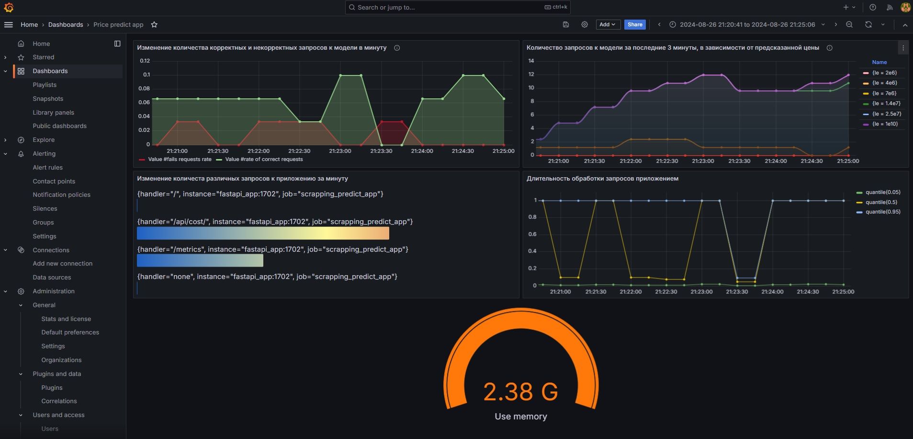

# Мониторинг

Дашборд предназначен для мониторинга различных метрик нашего приложения на основе FastAPI, работающего с предсказанием цен на объекты недвижимости.
Он обновляется каждые 5 секунд и отображает данные за последние 30 минут.

Дашборд предоставляет ключевые метрики, которые помогают в мониторинге производительности приложения, а также в отслеживании числа запросов, их успешности, и ответов модели машинного обучения.

## Для мониторинга выбраны метрики нескольких слоев:

### Инфраструткурный слой:

- Использование виртуальной памяти процессом

Метрика-показатель использования виртуальной памяти процессом приложения.

Эта метрика выбрана, так как информацию о занимаемой памяти полезно отслеживать и вовремя видеть аномальное увеличение затрат памяти.

Используется Gauge (круговая диаграмма), потому что мы хотим видеть именно количество занимаемой памяти в данный момент времени.

### Метрики реального времени:

- Количество запросов к модели за последние 3 минуты, в зависимости от предсказанной цены

Метрика показывает количество запросов к модели в зависимости от предсказанной цены. Для каждой линии задается свой интервал значений.

Эта метрика выбрана, так как по ней хорошо видно, в каких диапазонах находятся предсказанные моделью величины и как количественно они распределяются между интервалами значений (бакетами). При смещении предсказаний или данных по данной метрике можно будет заметить большее количество нетипичных предсказаний.

Используется линейный график (Time series), потому что на нем хорошо видно изменения предсказаний модели в текущем времени.

### Метрики прикладного уровня:

- Изменение количества корректных и некорректных запросов к модели в минуту.

График отображает количество успешных и неудачных запросов к модели, поступивших в течение последней минуты.

Эта метрика выбрана, так как по ней можно увидеть, насколько много проблем появляется у пользователей с корректным заполнением запроса. Также по ней видно количество запросов, приходящих в модель.

Используется линейный график (Time series), потому что он четко показывает взаимное изменение количества удачных и неудачных запросов.

- Изменение количества различных запросов к приложению за минуту

График отображает изменение количества запросов относительно друг друга к приложению за минуту.

Эта метрика выбрана, так как по ней хорошо видно, насколько активно пользуются приложением в данную минуту, и какая часть запросов является инфраструктурной, а какая пользовательскими запросами к модели.

Используется Bar gauge (столбчатая горизонтальная диаграмма) так как является более показательной в сравнении типов запросов.

- Длительность обработки запросов приложением

График отображает длительность обработки запросов, с распределением по квантилям (0.05, 0.5, 0.95).

Эта метрика выбрана, так как нам важно видеть статистические показатели времени обработки запросов приложением, для детекции сбоев в работе.

Используется линейный график (Time series), так как на нем можно удобно показать квантильные распределения в реальном времени.

